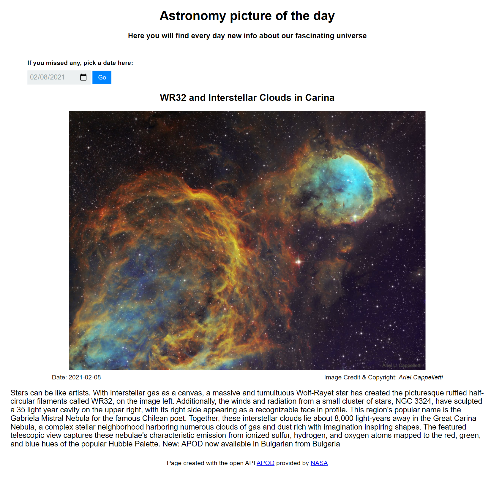

# Astronomy Picture of the Day

An example of consuming an API Rest with the open API "APOD"

Each day you will find here a new Astronomy picture. You can also go back to a specific date and see the image / video of that day if you missed it

## Screenshot

